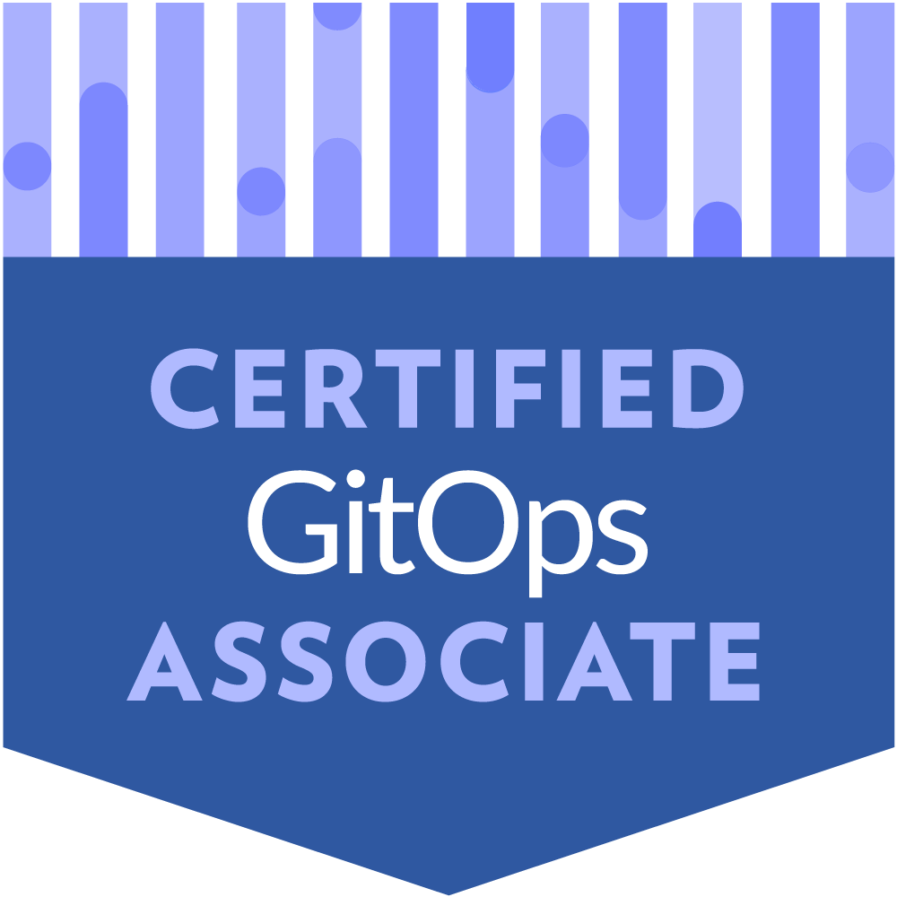
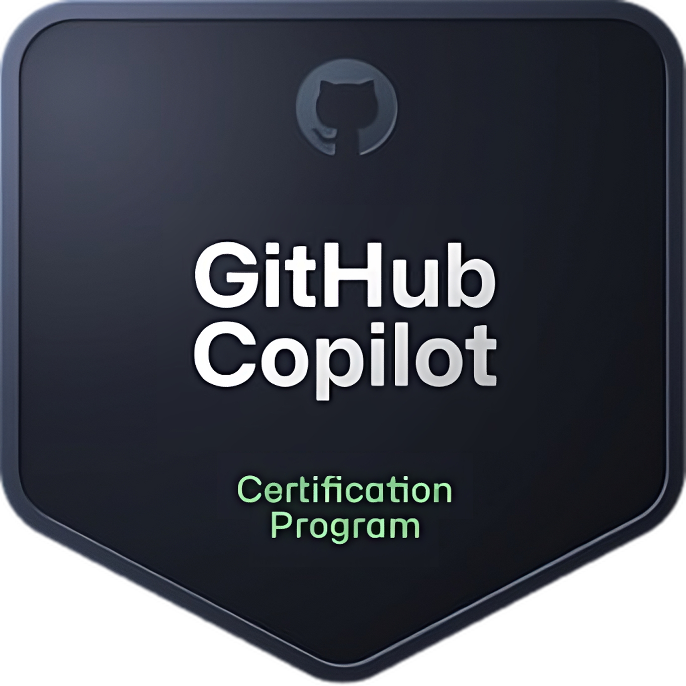

<h2> Analista Programador Computacional & Infra/Ops Student. </h2>

<!-- <div style="margin-left: 20%;"> -->
	<!---->

<h3 align=center>Busca guías y apuntes en mi <a href="https://github.com/keaguirre/Notebook">repositorio de notas</a>!</h3>
<h1>Certificaciones</h1>
 <a href="https://www.credly.com/badges/8e51e50c-da07-42f4-982a-a96d4b02eac2/public_url" target="_blank"></a>
 <a href="https://www.credly.com/badges/f6fadca9-4118-4900-9fde-e6b8ce0acb66/public_url" target="_blank"></a>
 <a href="https://learn.microsoft.com/es-mx/users/keaguirre/credentials/4aab756c5eb98ee0?ref=https%3A%2F%2F" target="_blank"></a>
 <a href="https://cs.lpi.org/caf/Xamman/certification/verify/LPI000590520/3bnv3x7jd6" target="_blank"></a>
 <a href="https://www.credly.com/badges/f4ec4fe6-dfd7-4ce6-bd19-01fbf9c1f0ca/public_url" target="_blank"></a>
 
<h1>Reciente</h1>
			
<h1>Experiencia</h1>
<ul>
	<li>
		<h2>	
			<a href="https://github.com/keaguirre/cafeScript">CafeScript</a> & 
		    	<a href="https://github.com/keaguirre/cafeScript-Backend">CafeScript Backend</a>
			
		</h2>
		<h3>App de Autoservicio para Cafetería cafeScript</h3>
	</li>
	<li>
		<h2>	
			<a href="https://github.com/keaguirre/teLlevoApp">TeLlevoAPP</a> & 
		    	<a href="https://github.com/keaguirre/teLlevoAPP-Backend">TeLlevoAPP Backend</a>
			
			
		</h2>
		<h3>App de coordinación de movilización entre estudiantes</h3>
	</li>
	<li>
		<h2>Otros</h2>
		
		
	</li>
</ul>


<!--START_SECTION:waka-->

```txt
From: 19 May 2025 - To: 26 May 2025

Total Time: 7 hrs 24 mins

Docker       2 hrs 2 mins    ⚫⚫⚫⚫⚫⚫⚫⚪⚪⚪⚪⚪⚪⚪⚪⚪⚪⚪⚪⚪⚪⚪⚪⚪⚪   27.63 %
Bash         1 hr 28 mins    ⚫⚫⚫⚫⚫⚪⚪⚪⚪⚪⚪⚪⚪⚪⚪⚪⚪⚪⚪⚪⚪⚪⚪⚪⚪   19.86 %
Astro        1 hr 22 mins    ⚫⚫⚫⚫⚫⚪⚪⚪⚪⚪⚪⚪⚪⚪⚪⚪⚪⚪⚪⚪⚪⚪⚪⚪⚪   18.53 %
Markdown     1 hr 13 mins    ⚫⚫⚫⚫⚪⚪⚪⚪⚪⚪⚪⚪⚪⚪⚪⚪⚪⚪⚪⚪⚪⚪⚪⚪⚪   16.62 %
SSH Config   30 mins         ⚫⚫⚪⚪⚪⚪⚪⚪⚪⚪⚪⚪⚪⚪⚪⚪⚪⚪⚪⚪⚪⚪⚪⚪⚪   06.81 %
```

<!--END_SECTION:waka-->
